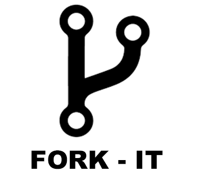

<html>

<p id="top"><p>
<p align="center">
    <br><br>
</hp>

<h4 align="center">Let's Fork it!<h4>
<p align="center">
	 <a href="https://github.com/fork-it/weFork/#repositories" target="_blank" title="Included In weFork">
	</p>


<h4 align="center">
	<br><br>
	<a href="#contributing">🔁 Contributing</a>&nbsp;&nbsp;&nbsp;
	<a href="#join"> 🤝  Join</a>&nbsp;&nbsp;&nbsp;
	
	<a href="#repositories">Repositories</a>&nbsp;&nbsp;&nbsp;
	<a href="credits.md">📋 Credits </a>&nbsp;&nbsp;&nbsp;
	
	<a href="https://gitter.im/Fork-it/Lobby"> Gitter </a>&nbsp;&nbsp;&nbsp;
	<a href="LICENSE"> ⚖ &nbsp;&nbsp;License</a>&nbsp;&nbsp;&nbsp;
	<br><br>
</h4>

[link](#1)

---
<h4 align="center">Share on: <h4>
<h4 align="center">
	<br><br>
	<!-- Twitter -->
	
	<a href="https://twitter.com/intent/tweet?text=Get%20your%20repository%20forked%20at%20https://github.com/fork-it/weFork">Twitter</a>&nbsp;&nbsp;&nbsp;
	<!-- Facebook -->
	
	<a href="https://www.facebook.com/sharer/sharer.php?s=100&p%5Burl%5D=https://github.com/fork-it/weFork"> Facebook</a>&nbsp;&nbsp;&nbsp;
	<!-- Google Plus -->
	
	<a href="https://plus.google.com/share?url=https://github.com/fork-it/weFork">Google Plus</a>&nbsp;&nbsp;&nbsp;
	<!-- Linkedin -->
	
	<a href="https://www.linkedin.com/sharing/share-offsite?mini=true&url=https://github.com/fork-it/weFork&title=Get%20your%20repository%20forked&summary=&source="> Linkedin </a>&nbsp;&nbsp;&nbsp;
	<br><br>
</h4>

---
<br>
<h4 id="contributing" align="center">Contributing 🔁 </h4>
<br>
<html>
	
<p align="center">
	<a href="https://www.codetriage.com/fork-it/wefork" alt="Code Triangle Code Helper">
	
	</a>
	<br>
</p>

1. Fork this project &nbsp;&nbsp;&nbsp; [](https://github.com/fork-it/weFork/fork) 
2. Add your `repository name` + `repository link` + `author` + `original repository link` to the forked repository.

Then make a pull request so will look like this:

<br>

```markdown
|[Repo Name](Desired URL)|[Repo Name](Original Repo URL)|](RepoURL/fork)|
```
where:

`ForkImagen` must be this Link: `https://img.shields.io/github/forks/USERNAME/REPO.svg?style=social&label=Fork`


and change _**USERNAME**_ by your username & _**REPO**_ by your repository URL .

This will generate an imagen like this [](https://github.com/fork-it/weFork/fork) 


### COLUMN 1

```md
| [Atom :atom:](https://github.com/fork-it/atom) |
    ⬆️                        ⬆️   
 Repo Name              Repo Desired URL (ex: atom)
 ```
 ### COLUMN 2
 ```md
[Atom](https://github.com/atom/atom)|
  ⬆️            ⬆️
Repo Name  Repo Original URL 
```
### COLUMN 3
```md
                                           USERNAME/REPO_NAME
					        ⬇️
[](https://github.com/atom/atom/fork)|
    ⬆️                                     ⬆️                                                         ⬆️
 Repo Name                        Repo Live Fork Imagen                                      Original Repo URL/fork
```

<br>

We will fork your repository with your desired `Repo Name` + your desired `Repo Link`. **Make sure the desired url is not taken by someone else's repository**

<br>
<h4 id="join" align="center">Join 🤝 </h4>
<br>

If you want to join the `Fork-it`  Organization just click on [join](https://github.com/fork-it/join), then follow the instructions, and you will be for sure part of us.

<br>
	<h4 id="repositories" align="center">Repositories </h4>
<br>

- `*1` Top 1 Github Repository with more Forks.
- `*2` Top 2 Github Repository with more Forks.
- `*3` Top 3 Github Repository with more Forks.

(#1)


| No | Repository | Author |Forks|
| -- | ------ | ----------- | ---- |
| 1 | [weFork 🔁 ](https://github.com/fork-it/weFork) |[Fork-it](https://github.com/fork-it/weFork)| [](https://github.com/fork-it/weFork/fork)|
| 2 | [Atom :atom:](https://github.com/fork-it/atom) |[Atom](https://github.com/atom/atom)| [](https://github.com/atom/atom/fork)|
| 3 | [Awesome 🕶](https://github.com/fork-it/awesome) |[Sindresorhus](https://github.com/sindresorhus/awesome)|[](https://github.com/sindresorhus/awesome/fork)|
| 4 | [Bootstrap ](https://github.com/fork-it/bootstrap)|[Twbs](https://github.com/twbs/bootstrap)|[](https://github.com/twbs/bootstrap/fork)|
| 5 | [VS Code ](https://github.com/fork-it/vscode)|[Microsoft](https://github.com/Microsoft/vscode)|[](https://github.com/Microsoft/vscode/fork)|
| 6 | [Webvrrocks 🎮](https://github.com/fork-it/webbrrocks)|[WebVRRocks](https://github.com/WebVRRocks/webvrrocks)|[](https://github.com/WebVRRocks/webvrrocks)|
| 7 | [React Native ⚛️](https://github.com/fork-it/react-native)|[Facebook](https://github.com/facebook/react-native)|[](https://github.com/facebook/react-native/fork)|
| 8 | [Reac Native Navigation](https://github.com/fork-it/react-native-navigation)|[Wix](https://github.com/wix/react-native-navigation)|[](https://github.com/wix/react-native-navigation/fork)|
| 9 | [Three.js 3️⃣](https://github.com/fork-it/three.js)|[Mrdoob](https://github.com/mrdoob/three.js)|[](https://github.com/mrdoob/three.js/fork)|
| 10 | [Emoji Cheat Sheet](https://github.com/fork-it/emoji-cheat-sheet.com)|[WebpageFX](https://github.com/WebpageFX/emoji-cheat-sheet.com)|[](https://github.com/WebpageFX/emoji-cheat-sheet.com/fork)|
| 11 | [Swift ](https://github.com/fork-it/swift)|[Apple](https://github.com/apple/swift)|[](https://github.com/apple/swift/fork)|
| 12 | [Angular 🅰️](https://github.com/fork-it/Angular)|[Angular](https://github.com/Angular/Angular)|[](https://github.com/Angular/Angular/fork)|
| 13 | [Node ](https://github.com/fork-it/Node)|[Nodejs](https://github.com/Nodejs/Node)|[](https://github.com/Nodejs/Node/fork)|
| 14 | [Electron ](https://github.com/fork-it/Electron)|[Electron](https://github.com/Electron/Electron)|[](https://github.com/Electron/Electron/fork)|
| 15 | [Next.js ⚠️](https://github.com/fork-it/Next.js)|[Zeit](https://github.com/zeit/next.js)|[](https://github.com/zeit/next.js/fork)|
| 16 | [Hyper ](https://github.com/fork-it/Hyper)|[Zeit](https://github.com/zeit/hyper)|[](https://github.com/zeit/hyper/fork)|
| 17| [Jekyll ](https://github.com/fork-it/Jekyll)|[Jekyll](https://github.com/Jekyll/Jekyll)|[](https://github.com/Jekyll/Jekyll/fork)|
| 18 | [Go ](https://github.com/fork-it/go)|[Golang](https://github.com/golang/go)|[](https://github.com/golang/go/fork)|
| 19 | [HTML ](https://github.com/fork-it/html)|[w3c](https://github.com/w3c/html)|[](https://github.com/w3c/html/fork)|
| 20| [Animate.css 🍿](https://github.com/fork-it/Animate.css)|[Daneden](https://github.com/daneden/animate.css)|[](https://github.com/daneden/animate.css/fork)|
| 21 | [Free Programming Books 📚](https://github.com/fork-it/free-programming-books)|[EbookFoundation](https://github.com/EbookFoundation/free-programming-books)|[](https://github.com/EbookFoundation/free-programming-books/fork)|
| 22 | [Materialize ](https://github.com/fork-it/Materialize)|[Dogfalo](https://github.com/Dogfalo/materialize)|[](https://github.com/Dogfalo/materialize/fork)|
| 23 | [Git ](https://github.com/fork-it/git)|[Git](https://github.com/git/git)|[](https://github.com/git/git/fork)|
| 24 | [Font Awesome ](https://github.com/fork-it/Font-Awesome)|[FortAwesome](https://github.com/FortAwesome/Font-Awesome)|[](https://github.com/FortAwesome/Font-Awesome/fork)|
| 25 | [Github Desktop ](https://github.com/fork-it/Desktop)|[Desktop](https://github.com/Desktop/Desktop)|[](https://github.com/Desktop/Desktop/fork)|
| 26 | [Amazon CLI ](https://github.com/fork-it/aws-cli)|[Aws](https://github.com/aws/aws-cli)|[](https://github.com/Desktop/Desktop/fork)|
| 27 | [Express  ](https://github.com/fork-it/express)|[Expressjs](https://github.com/expressjs/express)|[](https://github.com/expressjs/express/fork)|
| 28 | [Data Sharing 🛫 *1](https://github.com/fork-it/datasharing)|[Jtleek](https://github.com/jtleek/datasharing)|[](https://github.com/jtleek/datasharing/fork)|
| 29 | [Programming Assignment2🗼 *2](https://github.com/fork-it/programmingassignment2)|[Rdpeng](https://github.com/rdpeng/ProgrammingAssignment2)|[](https://github.com/rdpeng/ProgrammingAssignment2/fork)|
 | 30 | [Spoon-Knife 🥄 *3](https://github.com/fork-it/Spoon-Knife)|[Octacat](https://github.com/octocat/Spoon-Knife)|[](https://github.com/octocat/Spoon-Knife/fork)|
 | 31 | [ExData Plotting1 🏒](https://github.com/fork-it/ExData_Plotting1)|[Rdpeng](https://github.com/rdpeng/ExData_Plotting1)|[](https://github.com/rdpeng/ExData_Plotting1/fork)|
 | 32 | [Socket.io ](https://github.com/fork-it/socket.io)|[Socket](https://github.com/socketio/socket.io)|[](https://github.com/socketio/socket.io/fork)|
  | 33 | [React ⚛️](https://github.com/fork-it/react)|[Facebook](https://github.com/facebook/react)|[](https://github.com/facebook/react/fork)|
  | 34 | [Pxt ](https://github.com/fork-it/Pxt)|[Microsoft](https://github.com/Microsoft/pxt)|[](https://github.com/Microsoft/pxt/fork)|
  | 35 | [Draggable ](https://github.com/fork-it/Draggable)|[Shopify](https://github.com/Shopify/draggable)|[](https://github.com/Shopify/draggable/fork)|
  | 36 | [ReactiveCocoa 🥥](https://github.com/fork-it/ReactiveCocoa)|[ReactiveCocoa](https://github.com/ReactiveCocoa/ReactiveCocoa)|[](https://github.com/ReactiveCocoa/ReactiveCocoa/fork)|
  | 37 | [Elastic Search 💢](https://github.com/fork-it/elasticsearch)|[Elastic](https://github.com/elastic/elasticsearch)|[](https://github.com/elastic/elasticsearch/fork)|
 | 38 | [Travis-ci ](https://github.com/fork-it/travis-ci)|[Travis-ci](https://github.com/travis-ci/travis-ci)|[](https://github.com/travis-ci/travis-ci/fork)|
 | 49 | [TwitterOauth 💨 ](https://github.com/fork-it/twitteroauth)|[Abraham](https://github.com/abraham/twitteroauth)|[](https://github.com/abraham/twitteroauth/fork)|
| 50 | [TypeScript ](https://github.com/fork-it/TypeScript)|[Microsoft](https://github.com/Microsoft/TypeScript)|[](https://github.com/Microsoft/TypeScript/fork)|
| 51 | [Dot Net ☂️](https://github.com/fork-it/dotnet)|[Microsoft](https://github.com/Microsoft/Dotnet)|[](https://github.com/Microsoft/dotnet/fork)|
 | 52 | [D3 ](https://github.com/fork-it/d3)|[D3](https://github.com/d3/d3)|[](https://github.com/d3/d3/fork)|
| 53 | [Tensorflow ](https://github.com/fork-it/tensorflow)|[Tensorflow](https://github.com/tensorflow/tensorflow)|[](https://github.com/tensorflow/tensorflow/fork)|
| 54 | [SmartThingsPublic ](https://github.com/fork-it/SmartThingsPublic)|[SmartThingsCommunity](https://github.com/tensorflow/tensorflow)|[](https://github.com/SmartThingsCommunity/SmartThingsPublic/fork)|
| 55 | [Angular.js 🅰️](https://github.com/fork-it/Angular.js)|[Angular](https://github.com/Angular/Angular.js)|[](https://github.com/Angular/Angular.js/fork)|
| 56 | [Gitignore 👾](https://github.com/fork-it/Gitignore)|[Github](https://github.com/Github/Gitignore)|[](https://github.com/Github/Gitignore/fork)|
 | 57 | [Codetriage 🔺](https://github.com/fork-it/Codetriage)|[Codetriage](https://github.com/Codetriage/Codetriage)|[](https://github.com/Codetriage/Codetriage/fork)|
 | 58 | [Vapor ](https://github.com/fork-it/vapor)|[Vapor](https://github.com/vapor/vapor)|[](https://github.com/emacs-evil/evil/fork)|
| 59 | [Evil 🐽](https://github.com/fork-it/evil)|[Emacs-Evil](https://github.com/emacs-evil/evil)|[](https://github.com/emacs-evil/evil/fork)|
| 60 | [freeCodeCamp 📗](https://github.com/fork-it/freeCodeCamp)|[freeCodeCamp](https://github.com/freeCodeCamp )|[](https://github.com/freeCodeCamp/freeCodeCamp/fork)|
| 61 | [Learning Area 🦊](https://github.com/fork-it/learning-area)|[MDN](https://github.com/mdn/learning-area)|[](https://github.com/mdn/learning-area/fork)|
| 62 | [Shields ](https://github.com/fork-it/Shields)|[Badges](https://github.com/badges/shields)|[](https://github.com/badges/shields/fork)|
| 63 | [Brew 🍺](https://github.com/fork-it/brew)|[Howebrew](https://github.com/Homebrew/brew)|[](https://github.com/Homebrew/brew/fork)|
| 64 | [Mustache.js {](https://github.com/fork-it/mustache.js)|[Janl](https://github.com/janl/mustache.js)|[](https://github.com/janl/mustache.js/fork)|
| 65 | [jQuery ](https://github.com/fork-it/jquery)|[jQuery](https://github.com/jquery/jquery)|[](https://github.com/jquery/jquery/fork)|
| 66 | [You know JS 🐡](https://github.com/fork-it/You-Dont-Know-JS)|[Getify](https://github.com/getify/You-Dont-Know-JS)|[](https://github.com/getify/You-Dont-Know-JS/fork)|
| 67 | [HTML5 Boilerplate ](https://github.com/fork-it/html5-boilerplate)|[H5bp](https://github.com/h5bp/html5-boilerplate)|[](https://github.com/h5bp/html5-boilerplate/fork)|
| 68 | [Frontend Nanodegree Resume 🍄](https://github.com/fork-it/frontend-nanodegree-resume)|[Udacity](https://github.com/udacity/frontend-nanodegree-resume)|[](https://github.com/udacity/frontend-nanodegree-resume/fork)|
| 69 | [Create Your Own Adventure  🌊](https://github.com/fork-it/create-your-own-adventure)|[Udacity](https://github.com/udacity/create-your-own-adventure)|[](https://github.com/udacity/create-your-own-adventure/fork)|
| 70 | [iTerm2 🎬](https://github.com/fork-it/iTerm2)|[Gnachman](https://github.com/gnachman/iTerm2)|[](https://github.com/gnachman/iTerm2/fork)|
| 71 | [Linux 🐧](https://github.com/fork-it/Linux)|[Torvalds](https://github.com/torvalds/linux)|[](https://github.com/torvalds/linux/fork)|
| 72 | [OpenSource.Guide 🚦](https://github.com/fork-it/opensource.guide)|[Github](https://github.com/Github/opensource.guide)|[](https://github.com/Github/opensource.guide/fork)|
| 73 | [Moby ](https://github.com/fork-it/moby)|[Moby](https://github.com/moby/moby)|[](https://github.com/moby/moby/fork)|
| 74 | [Bitcoin ](https://github.com/fork-it/bitcoin)|[Bitcoin](https://github.com/bitcoin/bitcoin)|[](https://github.com/bitcoin/bitcoin/fork)|
| 75 | [Opencv 🌸](https://github.com/fork-it/opencv)|[Opencv](https://github.com/opencv/opencv)|[](https://github.com/opencv/opencv/fork)|
| 76 | [BrowserQuest 🚶](https://github.com/fork-it/BrowserQuest)|[Mozilla](https://github.com/mozilla/BrowserQuest)|[](https://github.com/mozilla/BrowserQuest/fork)|
| 77 | [Pdf.js 📃](https://github.com/fork-it/pdf.js)|[Mozilla](https://github.com/mozilla/pdf.js)|[](https://github.com/mozilla/pdf.js/fork)|
| 78 | [Go Ethereum 🥣](https://github.com/fork-it/go-ethereum)|[Ethereum](https://github.com/ethereum/go-ethereum)|[](https://github.com/ethereum/go-ethereum/fork)|


## License

[](https://github.com/fork-it/weFork/blob/master/LICENSE)

To the extent possible under law, [Fork it](https://github.com/fork-it) and [C. Abraham](https://github.com/19cah) has waived all copyright and related or neighboring rights to this work.

<html>
	<p align="center">
	    <a href="#top">Top ⬆️ </a>
	</p>
	<p align="center">
	    
	</p>
	<p align="center">
	    <small>2018 &copy let's Fork It. </small>
	</p>
</html>
